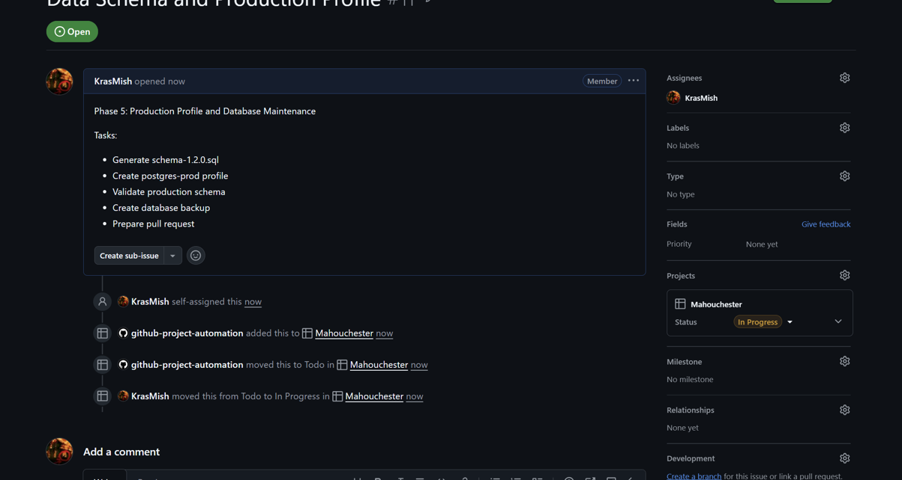
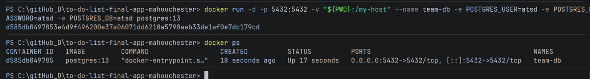
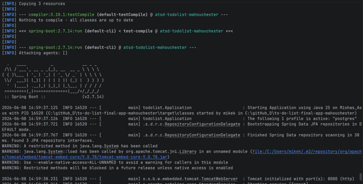
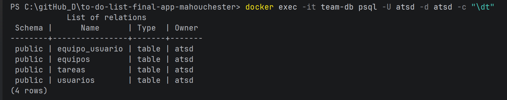
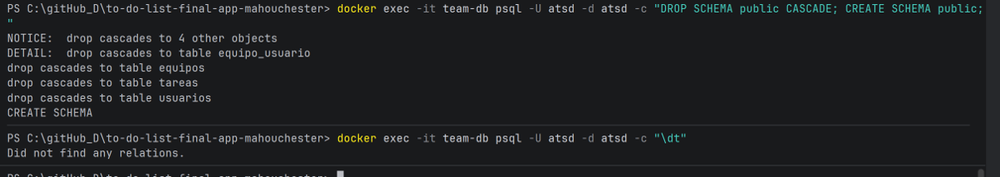
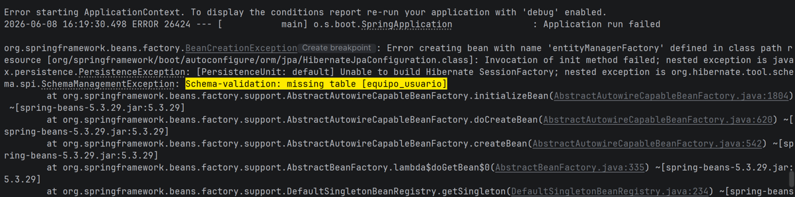
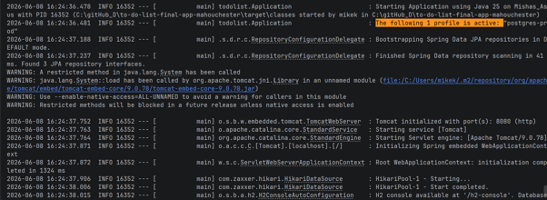

# TO DO LIST APP - MAHOUCHESTER.
### [v1.3.0] - 2026-06-08
### Project Description

**To Do List App** is a task management web application developed using **Spring Boot (Java)**
and **Maven**. It allows users to create, organize, and track their daily tasks efficiently
through a clean and simple interface.

This project is being developed by the **Mahouchester** team, composed of:
- Jaume Climent
- Jhener Albarado Mamani
- James Brown
- Mykhailo Krasin

After evaluating the previous iterations of the project, the team has agreed to continue
development based on the version originally built by **Jaume Climent** and **Jhener**,
which was selected as the foundation for **v1.3.0**.

## Task 4 - Team Description Feature

As part of the fourth task, a new feature was added to improve the team management functionality of the application.

The implemented feature consists of adding a **description field for teams**. This allows each team to include additional information about its purpose, objectives, or general details. With this improvement, teams are easier to identify and manage inside the application.

The team description feature was integrated into the existing team functionality and connected with the database so that the description can be saved and retrieved correctly.

This feature includes:

- A new description attribute for teams.
- Support for storing additional information about each team.
- Integration with the existing team management logic.
- Database persistence for the team description.
- Compatibility with the PostgreSQL profile used in the Docker deployment.


## DockerHub Image

The Docker image for this project has been published to DockerHub.

**DockerHub image:**

```bash
jamesbobbrown/todolist-mahouchester:1.3.0-snapshot
```

To download the image, run:

```bash
docker pull jamesbobbrown/todolist-mahouchester:1.3.0-snapshot
```

To test the image with the Postgres profile and a custom database host, run:

```bash
docker run --rm jamesbobbrown/todolist-mahouchester:1.3.0-snapshot --spring.profiles.active=postgres --POSTGRES_HOST=host-prueba
```

This command is expected to fail with an `UnknownHostException` because `host-prueba` does not exist. This confirms that the Docker image correctly accepts runtime parameters and loads the Postgres profile.


link: 
hub.docker.com/repository/docker/jamesbobbrown/todolist-mahouchester/general


## To test the image with the Postgres profile and a custom database host:
```bash
docker run --rm jamesbobbrown/todolist-mahouchester:1.3.0-snapshot --spring.profiles.active=postgres --POSTGRES_HOST=host-prueba
```
- This command is expected to fail with an UnknownHostException because host-prueba does not exist. This confirms that the Docker image correctly accepts runtime parameters and loads the Postgres profile.

### 1. Setting up the Network and Database
First, we created a Docker network to allow secure communication between the application and the database using network aliases:
```bash
docker network create team-network
```
Next, we launched the PostgreSQL 13 database container (team-db), exposing it to the network under the alias postgres and
mounting the local directory to # /my-host to ensure data persistence and volume mapping:
```bash
docker run -d --network team-network --network-alias postgres -v $(pwd):/my-host --name team-db -e POSTGRES_USER=atsd -e POSTGRES_PASSWORD=atsd -e POSTGRES_DB=atsd postgres:13
```
(Note: If running on Windows PowerShell, use \${PWD} instead of \$(pwd) ).

### 2. Connecting the ApplicationWe connected the application container to the same #network, passing the active database profile and the correct database host parameter pointing to our container alias:
```bash
docker run --rm --network team-network -p 8080:8080 jamesbobbrown/todolist-mahouchester:1.3.0-snapshot --spring.profiles.active=postgres --POSTGRES_HOST=postgres
```


Docker Status Verification:
Here is the confirmation showing both containers running simultaneously and linked under the same network:

### 3. Data Persistence & Integrity Verification

To verify that data persists independently of the application container lifecycle, we performed the following stress test

- 1. Accessed http://localhost:8080 and registered a new test user (jaume_test), then created several tasks.

- 2. Terminated the application container using Ctrl + C (which completely destroyed the container due to the --rm flag).

- 3. Relaunched the application container using the same Docker command.

4 Refreshed the browser and verified that the user account and data remained intact, proving that data is safely persistent
inside the team-db container volume.

### 4. Database Schema Auditing via psql
We inspected the inner tables of the running PostgreSQL container to ensure Hibernate mapped the tables correctly.
```bash
docker exec -it team-db bash
psql -U atsd -W atsd

Inside the CLI, we verified the database presence and audited the active user records:

\dt
SELECT * FROM usuarios;
```

### Database Query Proof:
Below is the terminal screenshot showing the internal database tables and the successfully persistent test user account:

 

## Phase 5 - Data Schema and Production Profile

As part of Phase 5, a PostgreSQL production environment was configured and validated.

### 1. Issue and Branch Creation

An issue called **"Data Schema and Production Profile"** was created and assigned to Mykhailo Krasin.

The branch used for development was:

```text
data-schema
```



---

### 2. PostgreSQL Deployment

A PostgreSQL 13 container was started using Docker and connected to the application.



---

### 3. PostgreSQL Profile and Schema Generation

The application was launched using the `postgres` profile. Hibernate generated the database schema and created all required tables.





The database schema was exported using pg_dump and stored as:

```text
sql/schema-1.2.0.sql
```

---

### 4. Production Profile Validation

A dedicated production profile was created:

```text
src/main/resources/application-postgres-prod.properties
```

with:

```properties
spring.jpa.hibernate.ddl-auto=validate
```

The database schema was intentionally removed to verify that the application correctly fails during startup when required tables are missing.



The application failed with:

```text
Schema-validation: missing table [equipo_usuario]
```



After restoring the schema from `schema-1.2.0.sql`, the application started successfully.



---

### 5. Database Backup

A PostgreSQL backup was generated and stored as:

```text
sql/backup08062026.sql
```

This backup can be used to restore the database state and verify schema integrity.
