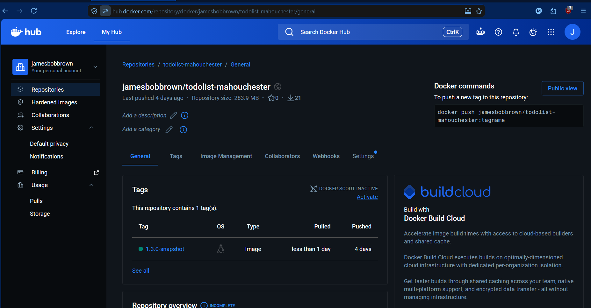

# TO DO LIST APP - MAHOUCHESTER.

### Nuestro equipo.
- Jhener Albarado Mamani.
- Jaume Climent ....
- James Brown .
- Mykhailo ...


# DockerHub Image

The Docker image for this project has been published to DockerHub.

**DockerHub image:**

```bash
jamesbobbrown/todolist-mahouchester:1.3.0-snapshot
```

To download the image, run:

```bash
docker pull jamesbobbrown/todolist-mahouchester:1.3.0-snapshot
```

To test the image with the Postgres profile and a custom database host, run:

```bash
docker run --rm jamesbobbrown/todolist-mahouchester:1.3.0-snapshot --spring.profiles.active=postgres --POSTGRES_HOST=host-prueba
```

This command is expected to fail with an `UnknownHostException` because `host-prueba` does not exist. This confirms that the Docker image correctly accepts runtime parameters and loads the Postgres profile.



## To test the image with the Postgres profile and a custom database host, run:

docker run --rm jamesbobbrown/todolist-mahouchester:1.3.0-snapshot --spring.profiles.active=postgres --POSTGRES_HOST=host-prueba

## This command is expected to fail with an UnknownHostException because host-prueba does not exist. This confirms that the Docker image correctly accepts runtime parameters and loads the Postgres profile.


### 1. Setting up the Network and Database
First, we created a Docker network to allow secure communication between the application and the database using network aliases:

docker network create team-network

Next, we launched the PostgreSQL 13 database container (team-db), exposing it to the network under the alias postgres and mounting the local directory to # /my-host to ensure data persistence and volume mapping:

docker run -d --network team-network --network-alias postgres -v $(pwd):/my-host --name team-db -e POSTGRES_USER=atsd -e POSTGRES_PASSWORD=atsd -e POSTGRES_DB=atsd postgres:13

(Note: If running on Windows PowerShell, use ${PWD} instead of $(pwd) ).

### 2. Connecting the ApplicationWe connected the application container to the same #network, passing the active database profile and the correct database host parameter pointing to our container alias:

docker run --rm --network team-network -p 8080:8080 jamesbobbrown/todolist-mahouchester:1.3.0-snapshot --spring.profiles.active=postgres --POSTGRES_HOST=postgres


Docker Status Verification:
Here is the confirmation showing both containers running simultaneously and linked under the same network:

### 3. Data Persistence & Integrity Verification

To verify that data persists independently of the application container lifecycle, we performed the following stress test

1  Accessed http://localhost:8080 and registered a new test user (jaume_test), then created several tasks.

2 Terminated the application container using Ctrl +   C (which completely destroyed the container due to the --rm flag).

3 Relaunched the application container using the same Docker command.

4 Refreshed the browser   and verified that the user account and data remained intact, proving that data is safely persistent inside the team-db container     volume.

### 4. Database Schema Auditing via psql
We inspected the inner tables of the running PostgreSQL container to ensure Hibernate mapped the tables correctly.

docker exec -it team-db bash
psql -U atsd -W atsd

Inside the CLI, we verified the database presence and audited the active user records:

\dt
SELECT * FROM usuarios;

### Database Query Proof:
Below is the terminal screenshot showing the internal database tables and the successfully persistent test user account:

 
